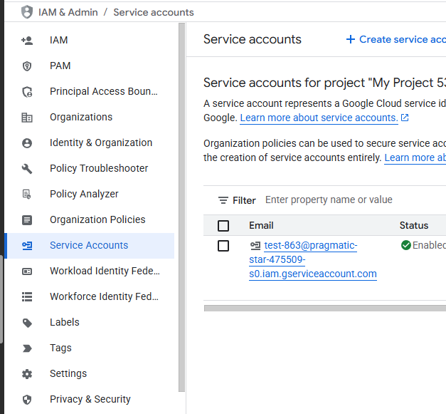
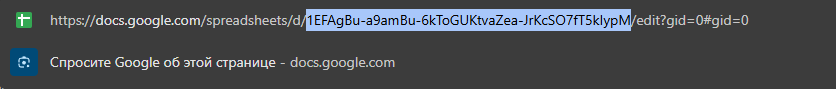

# для выполнения тестового задания

## Описание
Шаблон подготовлен для того, чтобы попробовать сократить трудоемкость выполнения тестового задания.

В шаблоне настоены контейнеры для `postgres` и приложения на `nodejs`.  
Для взаимодействия с БД используется `knex.js`.  
В контейнере `app` используется `build` для приложения на `ts`, но можно использовать и `js`.

Шаблон не является обязательным!\
Можно использовать как есть или изменять на свой вкус.

Все настройки можно найти в файлах:
- compose.yaml
- dockerfile
- package.json
- tsconfig.json
- src/config/env/env.ts
- src/config/knex/knexfile.ts

## Подготровка env файла:
создать на основе example.env файл .env
заполнить поля WB_API_TOKEN

для полей:
GOOGLE_SERVICE_ACCOUNT_EMAIL
GOOGLE_PRIVATE_KEY -!указать в ковычках, без переносов и пробелов в налчае и конце строки

можно получить данные в https://console.cloud.google.com/iam-admin/iam?hl=en

создав проект и сервисного пользователя (следуйте инструкции google)


GOOGLE_SHEET_IDS - можно получить из строки запроса.


page=имя первой странице в книге

## Команды:

Запуск базы данных:
```bash
docker compose up -d --build postgres
```

Для выполнения миграций и сидов не из контейнера:
```bash
npm run knex:dev migrate latest
```

```bash
npm run knex:dev seed run
```
Также можно использовать и остальные команды (`migrate make <name>`,`migrate up`, `migrate down` и т.д.)

Для запуска приложения в режиме разработки:
```bash
npm run dev
```

Запуск проверки самого приложения:
```bash
docker compose up -d --build app
```

Для финальной проверки рекомендую:
```bash
docker compose down --rmi local --volumes
docker compose up --build
```

PS: С наилучшими пожеланиями!
